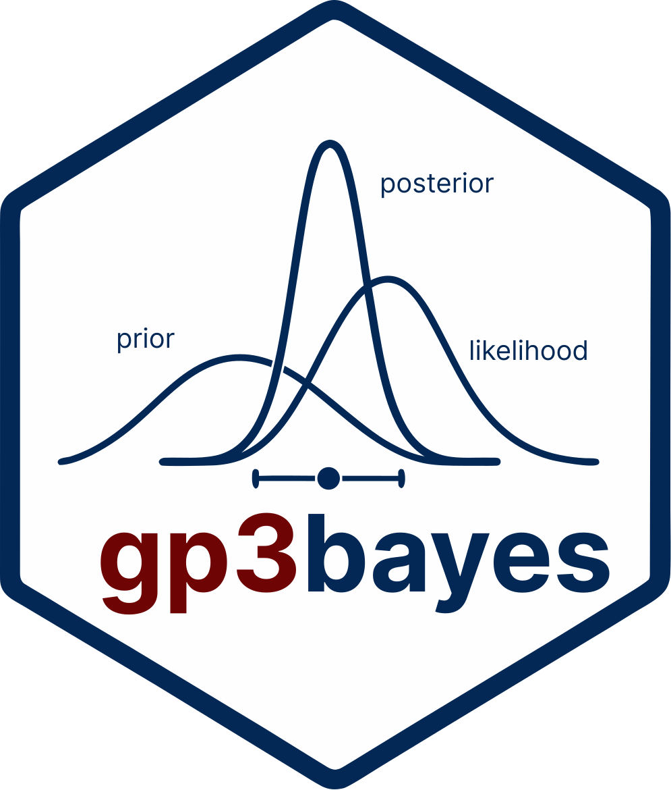

---
output:
  github_document:
    toc: false
    html_preview: false
---

<!-- README.md is generated from README.Rmd. Edit README.Rmd, not README.md. -->

# gp3bayes 

[](https://doi.org/10.5281/zenodo.21518698)
[](https://CRAN.R-project.org/package=gp3bayes)

`gp3bayes` is an independent R package for transparent, contract-first Bayesian workflows for repeated-measures and hierarchical behavioural data, with a governed dynamic-pupillometry layer and explicit validation, sensitivity, prediction, and reporting infrastructure.

**Current GitHub release:** **0.5.0** (`v0.5.0`, 18 August 2026)

[Website](https://stefanosbalaskas.github.io/gp3bayes/) · [Reference](https://stefanosbalaskas.github.io/gp3bayes/reference/index.html) · [Articles](https://stefanosbalaskas.github.io/gp3bayes/articles/index.html) · [Release](https://github.com/stefanosbalaskas/gp3bayes/releases/tag/v0.5.0)

## What gp3bayes provides

- explicit model contracts, readiness audits, transformation replay, prior specifications, and prior-predictive checks;
- restricted hierarchical Bernoulli-logit and positive uncensored lognormal-duration workflows;
- backend-portable full-MCMC fitting through `brms` with `rstan` or `cmdstanr` where explicitly requested;
- posterior diagnostics, prediction, calibration, PSIS-LOO/K-fold validation, recovery, SBC, sensitivity, and publication evidence;
- governed dynamic pupillometry covering temporal dependence, robust distributions, Gaussian-process trajectories, measurement uncertainty, missingness, binocular modelling, response-shape models, and predictive calibration;
- structured model cards, evidence inventories, figures, tables, dashboards, and reproducibility manifests without automatic adequacy, robustness, exclusion, or model-selection claims.

## September 2026: retention-first Bayesian SCR responsivity

The current development branch adds `estimate_scr_responsivity_bayes()` for participant-level SCR responsivity accountability.

The function keeps the conventional amplitude-threshold non-responder flag for provenance, estimates a Beta-Binomial posterior response probability, and sets `retain_for_modeling = TRUE` for every participant with finite trial data. Low-reactive participants are therefore retained in the primary modelling dataset, while hard exclusion can be evaluated explicitly as a sensitivity specification rather than being imposed silently during preprocessing.

Posterior responsivity is a **graded modelling quantity**, not a diagnostic or psychological label. The implementation is dependency-light and does not claim to reproduce a Dirichlet-process mixture model.

See the [Retention-first Bayesian SCR responsivity article](https://stefanosbalaskas.github.io/gp3bayes/articles/scr-responsivity-sensitivity.html) and [`estimate_scr_responsivity_bayes()` reference](https://stefanosbalaskas.github.io/gp3bayes/reference/estimate_scr_responsivity_bayes.html).

## Bayesian dynamic pupillometry

`gp3bayes` 0.5.0 extends the contract-first workflow with governed vendor-neutral pupil time-course analysis. Pupil data are explicitly mapped and audited; the package does not silently interpolate missing samples, infer cognitive states, or select a preferred model automatically.

The 0.5 layer includes:

- Gaussian and Student-t observation models with governed residual-scale structures;
- AR/ARMA temporal dependence and governed Gaussian-process trajectories;
- measurement-error declarations and MAR-oriented missing-value models;
- binocular preparation and modelling without requiring upstream eye averaging;
- experimental nonlinear pupil response-shape models;
- temporal derivatives, dynamic contrasts, declared threshold-duration estimands, and posterior trajectories;
- PSIS-LOO, exact K-fold, leave-future-out planning, predictive calibration, model comparison, model cards, and sensitivity suites.

Start with the [Bayesian dynamic pupillometry article](https://stefanosbalaskas.github.io/gp3bayes/articles/bayesian-dynamic-pupillometry.html) or browse the [advanced pupillometry 0.5 articles](https://stefanosbalaskas.github.io/gp3bayes/articles/index.html).

## Model-family scope

The original contract-first core remains deliberately restricted to:

1. hierarchical Bernoulli-logit models for binary trial-level outcomes; and
2. hierarchical lognormal models for strictly positive uncensored durations.

Advanced pupil models are separately governed by their explicit pupil specifications and evidence gates. No interface accepts unrestricted formulas or arbitrary model families under an existing approved function name.

## Installation

Install the exact GitHub 0.5.0 release:

```r
install.packages("remotes")
remotes::install_github("stefanosbalaskas/gp3bayes", ref = "v0.5.0")
```

For the current development branch, including the September 2026 SCR responsivity addition:

```r
remotes::install_github("stefanosbalaskas/gp3bayes")
```

Optional Bayesian backends are only required for workflows that actually fit models.

## Minimal contract example

```r
library(gp3bayes)

contract <- create_model_contract(
  family = "binary",
  outcome_col = "selected",
  participant_col = "participant_id",
  item_col = "stimulus_id",
  trial_col = "trial_id",
  condition_col = "condition"
)

audit_model_readiness(data, contract)
```

Creating a contract does not validate a substantive hypothesis, fit a model, or establish model adequacy.

## Release validation

The `v0.5.0` release record reports:

- **458 public exports**;
- **230 S3 registrations**;
- **458/458 frozen public signatures**;
- **465 Rd files** and **59 vignette sources**;
- full backend-free test suite passed; and
- exact source-archive `R CMD check --as-cran`: **0 errors, 0 warnings, 0 notes**.

The September SCR responsivity addition is post-0.5.0 development functionality and is not represented as part of the immutable `v0.5.0` archive.

## Interpretation boundaries

Behavioural, gaze, pupil, EDA/SCR, cardiovascular, and other physiological measurements do not directly reveal emotion, stress, cognition, comprehension, personality, diagnosis, deception, intention, or another latent psychological state.

A fitted model, favorable diagnostic, posterior probability, predictive score, or model weight does not by itself establish causal identification, model adequacy, robustness, or substantive validity. Automatic participant exclusion and automatic model selection remain outside the package's governed decision boundary.

## Citation

Use the citation metadata supplied with the installed package:

```r
citation("gp3bayes")
packageVersion("gp3bayes")
```

The software concept DOI is [`10.5281/zenodo.21518698`](https://doi.org/10.5281/zenodo.21518698).

## Licence

MIT License.
