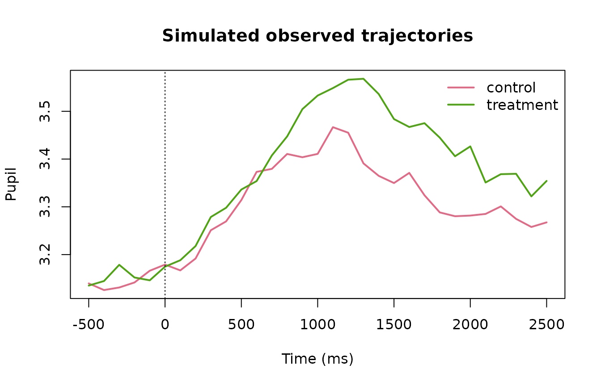
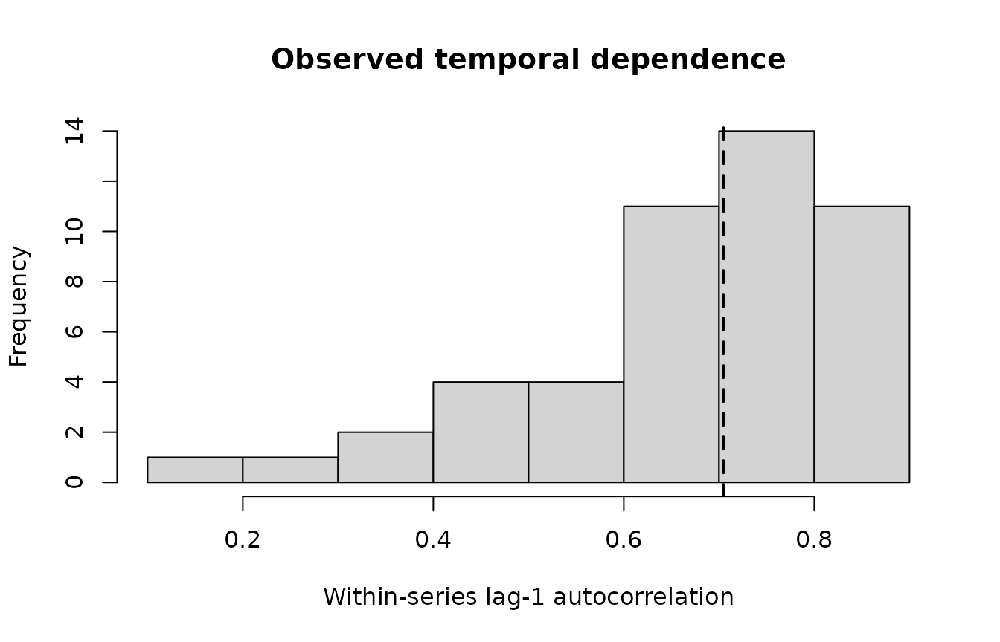

# Advanced Dynamic Pupillometry in gp3bayes 0.5

## Scope

gp3bayes 0.5 extends the governed 0.4 dynamic-pupillometry foundation
without replacing its data contract. The advanced layer makes the
observation distribution, residual scale, temporal dependence, temporal
function class, measurement uncertainty, missingness assumptions, and
predictive target explicit components of the model specification.

The layer remains deliberately narrow. It does not interpolate blinks,
infer cognitive states, identify causal effects, declare missingness
mechanisms true, or choose a preferred model automatically.

``` r

library(gp3bayes)
pupil_advanced_capabilities()
#>                                        capability       status
#> 1                      Gaussian observation model    supported
#> 2              Student-t robust observation model    supported
#> 3                   Distributional residual scale    supported
#> 4   AR(1), AR(2), bounded ARMA residual structure    supported
#> 5        Spline and Gaussian-process trajectories    supported
#> 6                   Known measurement uncertainty    supported
#> 7  MAR-oriented missing-response/predictor models    supported
#> 8                       Joint binocular modelling    supported
#> 9            PSIS-LOO and exact K-fold comparison    supported
#> 10          Explicit leave-future-out refit plans    supported
#> 11    Experimental nonlinear response-shape model experimental
#> 12                  Automatic blink interpolation     excluded
#> 13                  Automatic MNAR identification     excluded
#> 14            Automatic cognitive-state inference     excluded
#> 15               Automatic model winner selection     excluded
#> 16                Automatic causal interpretation     excluded
pupil_advanced_compatibility_table()
#>                       feature_a                               feature_b
#> 1                     Student-t                                    ARMA
#> 2                     Student-t                    distributional sigma
#> 3                      Gaussian                              AR2/ARMA11
#> 4                      Gaussian                    distributional sigma
#> 5                            GP                       approximate basis
#> 6                            GP exact basis > 500 unique time locations
#> 7        missing response model                                    ARMA
#> 8  measurement-error predictors                      missing predictors
#> 9                     binocular                    residual correlation
#> 10               response-shape                                    ARMA
#>             status
#> 1          blocked
#> 2        supported
#> 3        supported
#> 4        supported
#> 5        supported
#> 6  explicit opt-in
#> 7          blocked
#> 8        supported
#> 9        supported
#> 10 not implemented
#>                                                                                        rationale
#> 1       Robust likelihood and residual ARMA are compared as separate governed candidates in 0.5.
#> 2                 brms distributional regression supports sigma predictors for Student-t models.
#> 3                           Bounded ARMA orders are exposed only through the governed interface.
#> 4                                       Gaussian distributional models are a primary 0.5 target.
#> 5                                 Hilbert-space approximate GP is the default scalable GP route.
#> 6      Exact GP cubic scaling can become prohibitive and requires explicit computational review.
#> 7     Missing time points alter the residual-series contract; 0.5 does not silently bridge them.
#> 8  Joint mi()-based latent predictor submodels can carry both missingness and known uncertainty.
#> 9                    Multivariate Gaussian/Student models can estimate residual eye correlation.
#> 10                         The experimental nonlinear family remains deliberately narrow in 0.5.
```

## A backend-free advanced workflow

``` r

sim <- simulate_advanced_pupil_timecourse(
  n_participants = 12,
  trials_per_participant = 4,
  time_points = 31,
  family = "gaussian",
  ar = 0.45,
  heteroskedastic_strength = 0.35,
  missing_fraction = 0.04,
  seed = 2026
)

sim
#> <gp3bayes_pupil_advanced_simulation>
#>   Rows: 1488 
#>   Participants: 12 
#>   Family: gaussian 
#>   Missing fraction: 0.0417
plot_advanced_pupil_simulation(sim)
```



The simulator stores the generating truth separately from the observed
data. It is intended for examples and validation rather than as a
physiological pupil generator.

``` r

temporal_audit <- audit_pupil_temporal_dependence(sim$data)
temporal_audit
#> <gp3bayes_pupil_temporal_dependence_audit>
#>                 metric      value
#>                 series 48.0000000
#>          median_length 30.0000000
#>            median_lag1  0.7046917
#>        median_abs_lag1  0.7046917
#>    median_irregularity  0.0000000
#>  short_series_fraction  0.0000000
plot_pupil_temporal_dependence(temporal_audit)
```



## Declare an advanced model

``` r

distribution <- specify_pupil_distribution(
  family = "gaussian",
  residual_scale = "condition_time"
)

gp <- create_pupil_gp_spec(
  kernel = "matern32",
  basis = "approximate",
  k = 25
)

spec <- specify_advanced_pupil_timecourse_model(
  prepared = sim$data,
  temporal_structure = "gaussian_process",
  distribution = distribution,
  gp_spec = gp,
  autocorrelation = "none",
  covariates = c("baseline_pupil", "luminance"),
  predictive_target = "future_segment"
)

spec
#> <gp3bayes_pupil_advanced_specification>
#>   Version: 0.5.0.9000 
#>   Family: gaussian 
#>   Temporal structure: gaussian_process 
#>   Residual scale: condition_time 
#>   GP: matern32 / approximate 
#>   ARMA: (0,0) 
#>   Predictive target: future_segment 
#>   Complexity: ok 
#>   Fit performed: FALSE
pupil_advanced_specification_table(spec)
#>      version   family temporal_structure residual_scale gp_kernel    gp_basis
#> 1 0.5.0.9000 gaussian   gaussian_process condition_time  matern32 approximate
#>   gp_k arma_p arma_q participant_trajectory item_effects measurement_model
#> 1   25      0      0                   none        FALSE             FALSE
#>   missingness_model predictive_target complexity_status
#> 1             FALSE    future_segment                ok
plot_pupil_model_complexity(spec)
```


No Stan model has been compiled or fitted at this point.

## Translate, fit, diagnose, and estimate

Translation can be inspected without fitting when `brms` is installed.

``` r

translated <- translate_advanced_pupil_model_to_brms(spec)
translated

fit <- fit_advanced_pupil_model_backend(
  spec,
  backend = "cmdstanr",
  chains = 4,
  iter = 2000,
  warmup = 1000,
  cores = 2,
  seed = 2026
)

diagnose_advanced_pupil_fit(fit)
trajectory <- predict_advanced_pupil_trajectory(fit)
plot_advanced_pupil_trajectory(trajectory)

sigma <- estimate_pupil_residual_scale(fit)
plot_pupil_residual_scale(sigma)
```

The fit, diagnostics, posterior trajectory, and residual-scale model
answer different questions. A successful fit is not itself evidence of
adequacy, robustness, or substantive validity.
