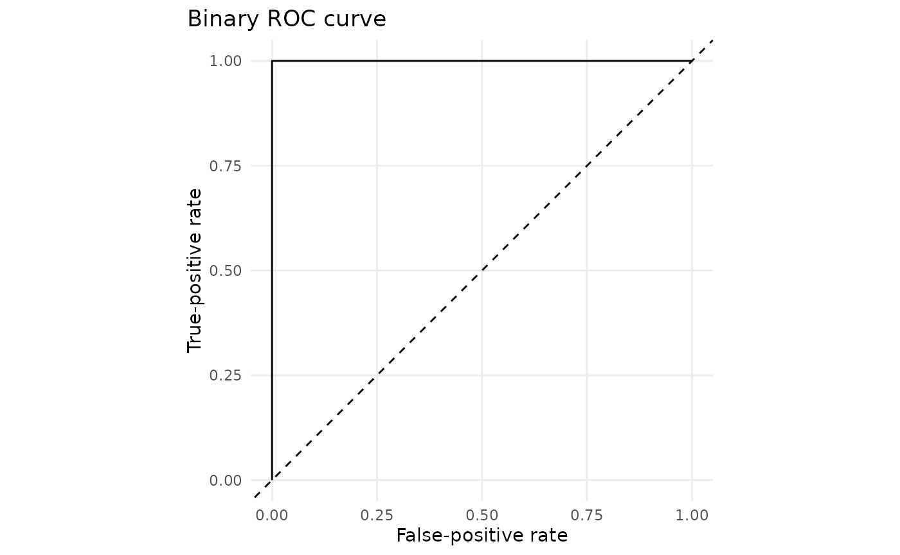
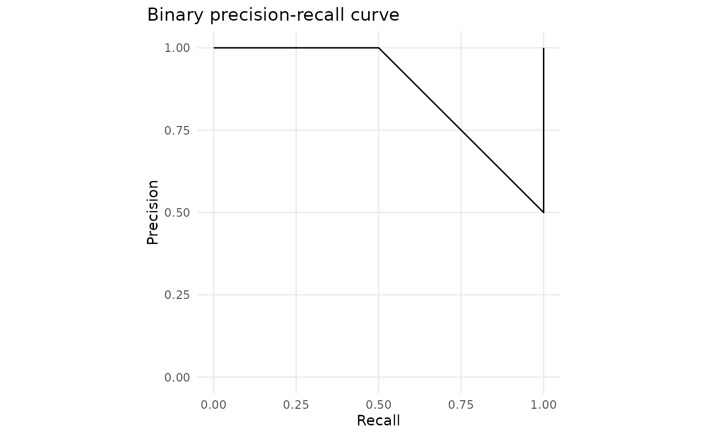

# Advanced Predictive Diagnostics

This article extends the prediction layer with diagnostics that remain
descriptive rather than becoming automatic acceptance or rejection
rules.

``` r

library(gp3bayes)

p <- c(0.05, 0.20, 0.75, 0.90)
y <- c(0, 0, 1, 1)

binary_confusion_table(p, y)
#>   observed predicted count threshold
#> 1        0         0     2       0.5
#> 2        0         1     0       0.5
#> 3        1         0     0       0.5
#> 4        1         1     2       0.5
binary_roc_curve(p, y)
#>   threshold false_positive_rate true_positive_rate
#> 1       Inf                 0.0                0.0
#> 2      0.90                 0.0                0.5
#> 3      0.75                 0.0                1.0
#> 4      0.20                 0.5                1.0
#> 5      0.05                 1.0                1.0
#> 6      -Inf                 1.0                1.0
binary_precision_recall_curve(p, y)
#>   threshold recall precision
#> 1       Inf    0.0 1.0000000
#> 2      0.90    0.5 1.0000000
#> 3      0.05    1.0 0.5000000
#> 4      -Inf    1.0 0.5000000
#> 5      0.20    1.0 0.6666667
#> 6      0.75    1.0 1.0000000
binary_calibration_error(p, y, bins = 2)
#>   n bins_requested bins_used expected_calibration_error
#> 1 4              2         2                       0.15
#>   maximum_calibration_error automatic_adequacy_verdict
#> 1                     0.175                      FALSE
```

``` r

plot_binary_roc(binary_roc_curve(p, y))
```



``` r

plot_binary_precision_recall(binary_precision_recall_curve(p, y))
```



For a fitted model, posterior predictive discrepancy checks retain the
entire replicated distribution:

``` r

pp <- predict_model(
  fit,
  type = "predictive",
  include_group_effects = TRUE,
  ndraws = 1000
)

check <- posterior_predictive_statistic(pp, statistic = "mean")
ppc_statistic_table(check)
plot_ppc_statistic(check)
```

Duration models additionally support predictive Q-Q and tail checks:

``` r

duration_qq_table(pp)
plot_duration_qq(pp)

tail <- duration_tail_check(pp, threshold = 2000)
plot_duration_tail(tail)
```

None of these diagnostics certifies adequacy automatically.
