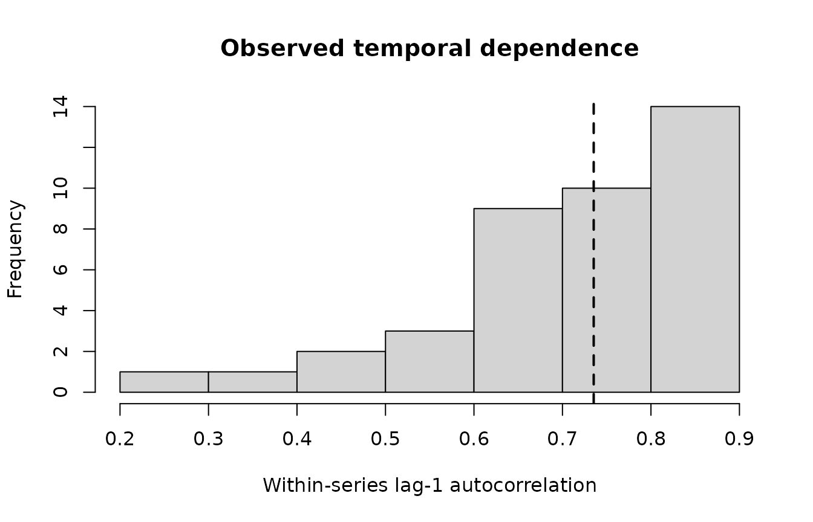

# Bounded ARMA and Temporal Diagnostics

``` r

library(gp3bayes)
sim <- simulate_advanced_pupil_timecourse(
  n_participants = 10,
  trials_per_participant = 4,
  time_points = 35,
  ar = c(0.55, -0.12),
  ma = 0.10,
  seed = 3010
)
```

## Audit first; do not select an order from a plot

``` r

audit <- audit_pupil_temporal_dependence(sim$data, max_lag = 8)
pupil_autocorrelation_table(audit, "summary")
#>                  metric      value
#> 1                series 40.0000000
#> 2         median_length 34.0000000
#> 3           median_lag1  0.7353051
#> 4       median_abs_lag1  0.7353051
#> 5   median_irregularity  0.0000000
#> 6 short_series_fraction  0.0000000
plot_pupil_temporal_dependence(audit)
```



The observed ACF can reflect residual dependence, misspecified mean
trajectories, design structure, preprocessing, or combinations of these.
gp3bayes therefore treats the audit as descriptive evidence rather than
an order-selection algorithm.

## Governed ARMA orders

``` r

create_pupil_arma_spec(1, 0)
#> $p
#> [1] 1
#> 
#> $q
#> [1] 0
#> 
#> $covariance
#> [1] FALSE
#> 
#> attr(,"class")
#> [1] "gp3bayes_pupil_arma_spec"
create_pupil_arma_spec(2, 0)
#> $p
#> [1] 2
#> 
#> $q
#> [1] 0
#> 
#> $covariance
#> [1] FALSE
#> 
#> attr(,"class")
#> [1] "gp3bayes_pupil_arma_spec"
create_pupil_arma_spec(1, 1)
#> $p
#> [1] 1
#> 
#> $q
#> [1] 1
#> 
#> $covariance
#> [1] FALSE
#> 
#> attr(,"class")
#> [1] "gp3bayes_pupil_arma_spec"
```

Orders are bounded to AR(3)/MA(2). The common shortcuts are available
directly in the model specification.

``` r

spec_ar1 <- specify_advanced_pupil_timecourse_model(sim$data, family = "gaussian", autocorrelation = "ar1")
spec_ar2 <- specify_advanced_pupil_timecourse_model(sim$data, family = "gaussian", autocorrelation = "ar2")
spec_arma11 <- specify_advanced_pupil_timecourse_model(sim$data, family = "gaussian", autocorrelation = "arma11")
```

## Post-fit residual comparison

``` r

fit_ar1 <- fit_advanced_pupil_model_backend(spec_ar1, backend = "cmdstanr")
fit_ar2 <- fit_advanced_pupil_model_backend(spec_ar2, backend = "cmdstanr")
fit_arma11 <- fit_advanced_pupil_model_backend(spec_arma11, backend = "cmdstanr")

acf_cmp <- compare_pupil_autocorrelation(
  ar1 = fit_ar1,
  ar2 = fit_ar2,
  arma11 = fit_arma11
)
plot_pupil_autocorrelation_comparison(acf_cmp)

spectrum <- pupil_residual_spectrum(fit_arma11)
plot_pupil_residual_spectrum(spectrum)
```

Residual spectra are deliberately descriptive. Peaks are not interpreted
as cognitive or physiological rhythms by gp3bayes.
