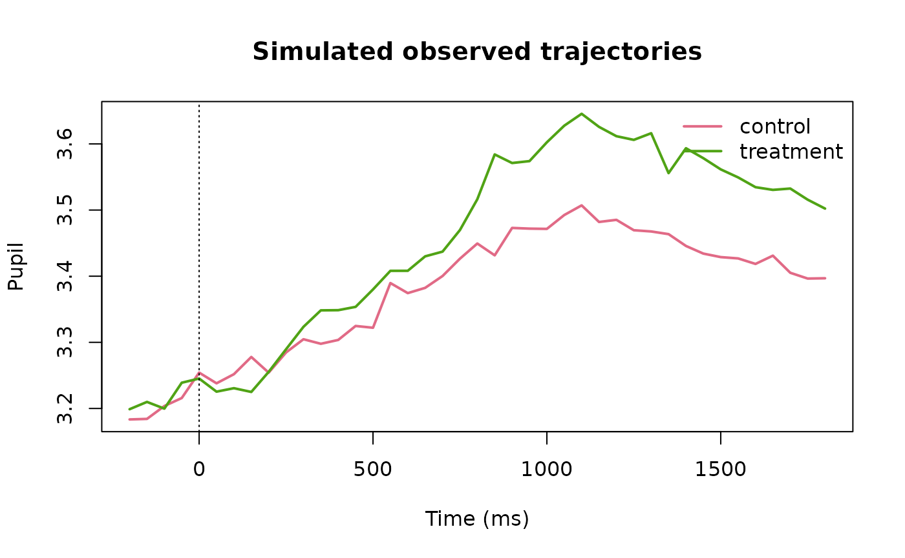

# Functional Dynamics and Predictive Calibration

## Purpose

Version 0.5 treats the posterior trajectory itself as an object from
which predeclared functional estimands can be derived. This avoids using
a single peak or selected window as the only description of temporal
change. The functions in this article remain descriptive: they do not
infer a physiological onset, changepoint, attention state, or cognitive
event.

## Backend-free simulation

``` r

library(gp3bayes)

sim <- simulate_advanced_pupil_timecourse(
  n_participants = 18,
  trials_per_participant = 4,
  time_points = 41,
  time_range = c(-200, 1800),
  family = "student",
  residual_scale = 0.08,
  seed = 2050
)

plot_advanced_pupil_simulation(sim)
```



## Fit declaration

``` r

spec <- specify_advanced_pupil_timecourse_model(
  sim$data,
  temporal_structure = "gaussian_process",
  family = "student",
  residual_scale = "condition_time",
  gp_spec = create_pupil_gp_spec("matern32", basis = "approximate", k = 25),
  autocorrelation = "none",
  predictive_target = "future_segment"
)

audit_advanced_pupil_identifiability(spec)
#> <gp3bayes_pupil_identifiability_audit>
#>   Overall: review 
#>   Certification: FALSE
#>        domain                      check          value status
#>        design                       rows           2952   pass
#>        design               participants             18   pass
#>        design     minimum_condition_rows           1476   pass
#>      temporal      minimum_series_length             41   pass
#>      temporal       median_series_length             41   pass
#>    trajectory         unique_time_points             41   pass
#>    trajectory              gp_basis_rank             25   pass
#>   missingness  response_missing_fraction        0.03117   pass
#>  distribution       distributional_sigma condition_time   pass
#>  distribution student_degrees_of_freedom      estimated review
pupil_model_card(spec)
#> <gp3bayes_pupil_model_card>
#>                   field            value
#>        gp3bayes_version       0.5.0.9000
#>           fit_performed            FALSE
#>                 backend             none
#>                    rows             2952
#>            participants               18
#>              conditions                2
#>                  family          student
#>      temporal_structure gaussian_process
#>          residual_scale   condition_time
#>         autocorrelation             none
#>  participant_trajectory             none
#>       measurement_model            FALSE
#>       missingness_model            FALSE
#>       predictive_target   future_segment
#>       complexity_status               ok
#> Governance:
#>   - No automatic preprocessing, interpolation, exclusion, or model selection.
#>   - No automatic cognitive-state, causal, or adequacy interpretation.
#>   - Measurement and missingness models remain assumption-conditional.
#>   - Predictive comparison is tied to an explicitly declared target.
```

The Student-t and ARMA layers are deliberately not combined by the
governed 0.5 interface. Robust observation tails and residual serial
dependence should first be assessed as separately declared candidate
explanations.

## Posterior derivatives

The following fit is intentionally not executed while building the
vignette.

``` r

fit <- fit_advanced_pupil_model_cmdstanr(spec)
traj <- predict_advanced_pupil_trajectory(fit, ndraws = 1000)

d1 <- estimate_pupil_trajectory_derivative(traj, order = 1)
plot_pupil_trajectory_derivative(d1)

contrast <- estimate_pupil_dynamic_contrast(
  traj,
  contrast = c("treatment", "control"),
  threshold = 0.05
)
plot_pupil_dynamic_contrast(contrast)

estimate_pupil_threshold_duration(
  contrast,
  direction = "absolute",
  threshold = 0.05
)
```

A derivative summarizes rate of posterior trajectory change. It is not
an automatic response-onset detector. Likewise, duration above a
threshold is only meaningful when that threshold was scientifically
prespecified.

## Predictive calibration on held-out data

``` r

cal <- audit_pupil_predictive_calibration(
  fit,
  newdata = held_out_trials,
  ndraws = 1000,
  probability = 0.90,
  allow_new_levels = FALSE
)

as.data.frame(cal)
plot_pupil_predictive_calibration(cal)
```

The reported RMSE, MAE, bias, interval coverage, interval width, and
draw-based CRPS describe the supplied prediction task. They become
out-of-sample evidence only when `newdata` was genuinely withheld from
fitting.
