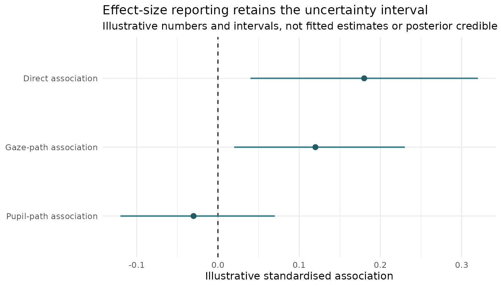
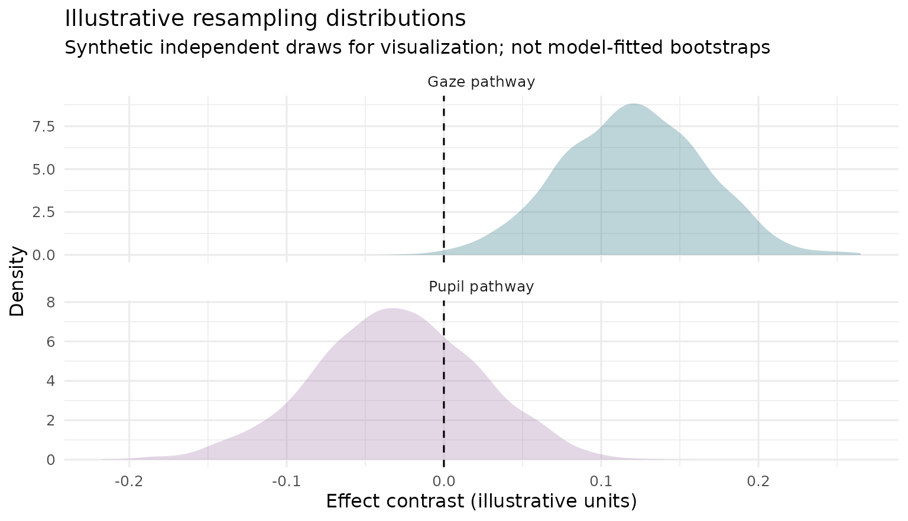
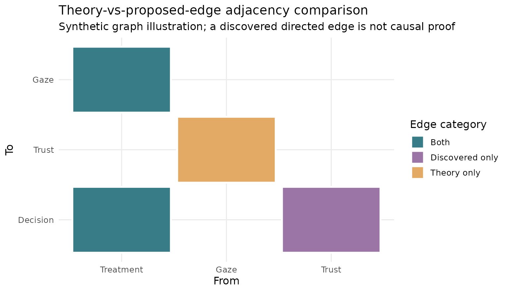
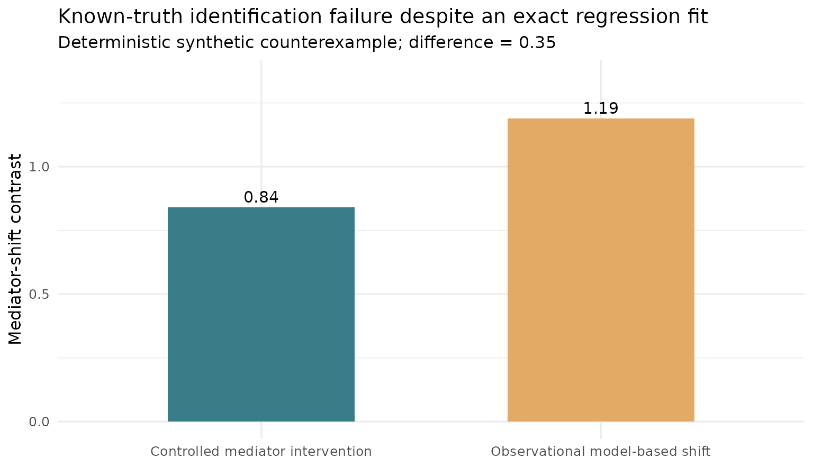

# Mediation evidence gallery: contrasts, uncertainty, and identification

## What the plots can, and cannot, establish

This reproducible article illustrates estimation-style visualizations
for experimental mediation research: reported effect intervals,
bootstrap distributions, graph-edge agreement, and an explicit
causal-identification failure. The graphics are inspired by the emphasis
on raw evidence and uncertainty in
[DABEST](https://acclab.github.io/DABEST-python/) and by the package’s
existing evidence atlas. They are **original, synthetic examples**
produced with ggplot2; they are not posterior draws from `gp3bayes`, and
they do **not** constitute evidence from an empirical study.

### Figure 1. Effect estimates with user-supplied uncertainty intervals

``` r

effects <- data.frame(
  estimand = factor(c("Direct association", "Gaze-path association",
                      "Pupil-path association"),
                    levels = rev(c("Direct association",
                                   "Gaze-path association",
                                   "Pupil-path association"))),
  value = c(.18, .12, -.03),
  lo = c(.04, .02, -.12),
  hi = c(.32, .23, .07)
)
ggplot2::ggplot(effects, ggplot2::aes(y = estimand, x = value)) +
  ggplot2::geom_vline(xintercept = 0, linetype = 2) +
  ggplot2::geom_segment(
    ggplot2::aes(x = lo, xend = hi, yend = estimand),
    linewidth = .8, colour = "#387C88"
  ) +
  ggplot2::geom_point(size = 2.5, colour = "#245B65") +
  ggplot2::labs(
    title = "Effect-size reporting retains the uncertainty interval",
    subtitle = "Illustrative numbers and intervals, not fitted estimates or posterior credible intervals",
    x = "Illustrative standardised association", y = NULL
  ) +
  ggplot2::theme_minimal(base_size = 12)
```



No interval type is implied by the appearance of a horizontal bar.
Always distinguish a frequentist confidence interval from a Bayesian
credible interval, and a descriptive mediated association from a
causally identified indirect effect.

### Figure 2. Resampling distribution, not a posterior without a Bayesian model

``` r

resampling <- data.frame(
  estimate = c(stats::rnorm(1800, .12, .045),
               stats::rnorm(1800, -.03, .052)),
  path = rep(c("Gaze pathway", "Pupil pathway"), each = 1800)
)
ggplot2::ggplot(
  resampling, ggplot2::aes(x = estimate, fill = path)
) +
  ggplot2::geom_density(alpha = .33, colour = NA) +
  ggplot2::geom_vline(xintercept = 0, linetype = 2) +
  ggplot2::facet_wrap(~path, ncol = 1, scales = "free_y") +
  ggplot2::scale_fill_manual(values = c(
    "Gaze pathway" = "#387C88", "Pupil pathway" = "#A987B4"
  )) +
  ggplot2::labs(
    title = "Illustrative resampling distributions",
    subtitle = "Synthetic independent draws for visualization; not model-fitted bootstraps",
    x = "Effect contrast (illustrative units)", y = "Density"
  ) +
  ggplot2::theme_minimal(base_size = 12) +
  ggplot2::theme(legend.position = "none")
```



The experimental `plot_mediation_evidence_atlas()` helper accepts
explicitly supplied empirical bootstrap draws or effect intervals. It
does not generate such draws, verify causal identification, or fit a
Bayesian posterior. See [gp3bayes research PR
\#28](https://github.com/stefanosbalaskas/gp3bayes/pull/28).

### Figure 3. Structural graph disagreement is not causal discovery

``` r

edge_comparison <- data.frame(
  from = factor(c("Treatment", "Gaze", "Trust", "Treatment"),
                levels = c("Treatment", "Gaze", "Trust")),
  to = factor(c("Gaze", "Trust", "Decision", "Decision"),
              levels = c("Decision", "Trust", "Gaze")),
  status = c("Both", "Theory only", "Discovered only", "Both")
)
ggplot2::ggplot(
  edge_comparison, ggplot2::aes(x = from, y = to, fill = status)
) +
  ggplot2::geom_tile(colour = "white", linewidth = 1, width = .94, height = .94) +
  ggplot2::scale_fill_manual(values = c(
    "Both" = "#387C88",
    "Theory only" = "#E2AA64",
    "Discovered only" = "#9B75A5"
  )) +
  ggplot2::labs(
    title = "Theory-vs-proposed-edge adjacency comparison",
    subtitle = "Synthetic graph illustration; a discovered directed edge is not causal proof",
    x = "From", y = "To", fill = "Edge category"
  ) +
  ggplot2::theme_minimal(base_size = 12)
```



Different DAGs can belong to the same Markov equivalence class, while a
graph learner can be unstable under omitted causes. An edge audit
records consistency of specifications; it cannot certify a causal
pathway.

### Figure 4. A correct regression fit can still be causally misleading

A deterministic research stress test uses `M = 0.4 + 0.7 X + U` and
`Y = 1 + 0.2 X + 0.6 M + 0.4 M² + 0.5 U`. Holding the unobserved common
cause `U` fixed, the controlled mediator-shift contrast is **0.84**;
fitting an observational quadratic regression while omitting `U` yields
a model-based contrast of **1.19**. The difference arises because the
mediator transmits confounding, not because the quadratic regression
failed to fit the observable relation.

``` r

stress <- data.frame(
  quantity = factor(
    c("Controlled mediator intervention", "Observational model-based shift"),
    levels = c("Controlled mediator intervention",
               "Observational model-based shift")
  ),
  effect = c(.84, 1.19)
)
ggplot2::ggplot(
  stress, ggplot2::aes(x = quantity, y = effect, fill = quantity)
) +
  ggplot2::geom_col(width = .55) +
  ggplot2::geom_text(
    ggplot2::aes(label = sprintf("%.2f", effect)),
    vjust = -0.4, size = 4
  ) +
  ggplot2::scale_fill_manual(values = c("#387C88", "#E2AA64")) +
  ggplot2::coord_cartesian(ylim = c(0, 1.35)) +
  ggplot2::labs(
    title = "Known-truth identification failure despite an exact regression fit",
    subtitle = "Deterministic synthetic counterexample; difference = 0.35",
    x = NULL, y = "Mediator-shift contrast"
  ) +
  ggplot2::theme_minimal(base_size = 12) +
  ggplot2::theme(legend.position = "none")
```



**Qualification boundary:** These are documentation-only synthetic
illustrations, not evidence that `gp3bayes` methods have been promoted
to stable APIs. External participant-level validation, model-fit checks,
measurement validity, and sensitivity to unobserved causes remain
essential. No CRAN release is implied.
