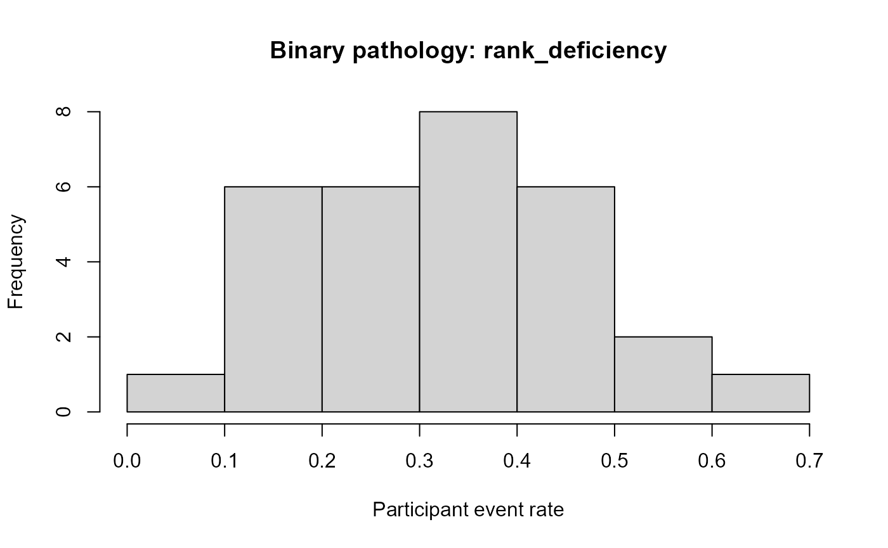

# Pathological Simulation Scenarios

The dedicated pathology generators make failure cases reproducible
instead of leaving them as prose-only limitations.

## Binary scenarios

``` r

binary_scenarios <- c(
  "null_contrast",
  "weak_information",
  "severe_imbalance",
  "near_separation",
  "omitted_random_slope",
  "sparse_item_structure",
  "all_zero_participants",
  "rank_deficiency",
  "missing_outcomes"
)

binary_results <- lapply(
  binary_scenarios,
  simulate_binary_pathology,
  seed = 2026
)

data.frame(
  scenario = binary_scenarios,
  expected_gate = vapply(
    binary_results,
    `[[`,
    character(1),
    "expected_gate"
  )
)
#>                scenario  expected_gate
#> 1         null_contrast pass_or_review
#> 2      weak_information         review
#> 3      severe_imbalance review_or_fail
#> 4       near_separation         review
#> 5  omitted_random_slope         review
#> 6 sparse_item_structure         review
#> 7 all_zero_participants review_or_fail
#> 8       rank_deficiency           fail
#> 9      missing_outcomes           fail
```

A rank-deficient design is an explicit structural failure:

``` r

rank_failure <- simulate_binary_pathology(
  "rank_deficiency",
  seed = 2026
)
evaluate_pathological_simulation(rank_failure)
#> 
#> Pathology evaluation
#>  Family: binary
#>  Scenario: rank_deficiency
#>  Expected gate: fail
#>  Structural status: fail
#>  Reason: The prepared fixed-effects design matrix is rank deficient.
#> Structural status is not a posterior adequacy decision. Review the expected failure mechanism and diagnostic context.
plot(rank_failure)
```



## Duration scenarios

``` r

duration_scenarios <- c(
  "null_ratio",
  "high_group_heterogeneity",
  "weak_information",
  "severe_imbalance",
  "heavy_tailed_contamination",
  "mixture",
  "censoring",
  "incorrect_unit",
  "zero_duration",
  "negative_duration"
)

duration_results <- lapply(
  duration_scenarios,
  simulate_duration_pathology,
  seed = 2026
)

data.frame(
  scenario = duration_scenarios,
  expected_gate = vapply(
    duration_results,
    `[[`,
    character(1),
    "expected_gate"
  )
)
#>                      scenario  expected_gate
#> 1                  null_ratio pass_or_review
#> 2    high_group_heterogeneity         review
#> 3            weak_information         review
#> 4            severe_imbalance review_or_fail
#> 5  heavy_tailed_contamination review_or_fail
#> 6                     mixture  fail_adequacy
#> 7                   censoring  fail_contract
#> 8              incorrect_unit  fail_contract
#> 9               zero_duration           fail
#> 10          negative_duration           fail
```

Censoring and incorrect measurement units are semantic contract failures
even when their numeric values could otherwise pass a simple range
check.

``` r

censored <- simulate_duration_pathology("censoring", seed = 2026)
wrong_unit <- simulate_duration_pathology("incorrect_unit", seed = 2026)

evaluate_pathological_simulation(censored)
#> 
#> Pathology evaluation
#>  Family: duration
#>  Scenario: censoring
#>  Expected gate: fail_contract
#>  Structural status: fail
#>  Reason: Censored observations violate the uncensored contract.
#> Structural status is not a posterior adequacy decision. Review the expected failure mechanism and diagnostic context.
evaluate_pathological_simulation(wrong_unit)
#> 
#> Pathology evaluation
#>  Family: duration
#>  Scenario: incorrect_unit
#>  Expected gate: fail_contract
#>  Structural status: fail
#>  Reason: The stored values and declared measurement unit disagree.
#> Structural status is not a posterior adequacy decision. Review the expected failure mechanism and diagnostic context.
```

Heavy tails and mixtures are adequacy stress tests. They do not trigger
an automatic switch to another likelihood.
