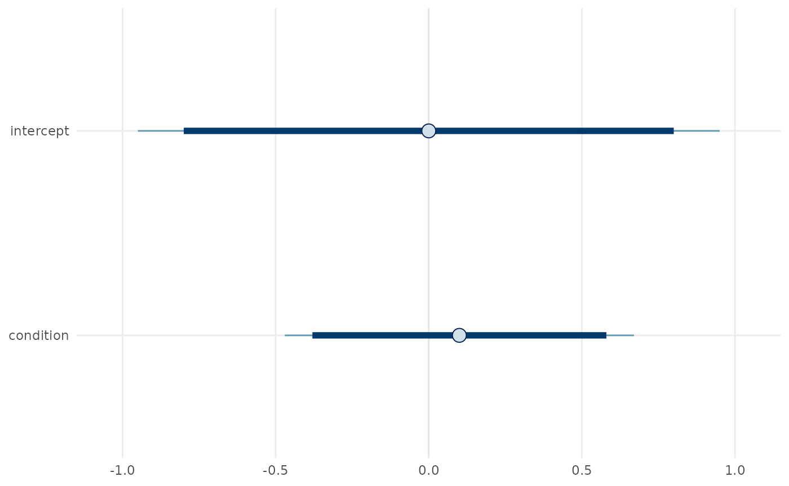
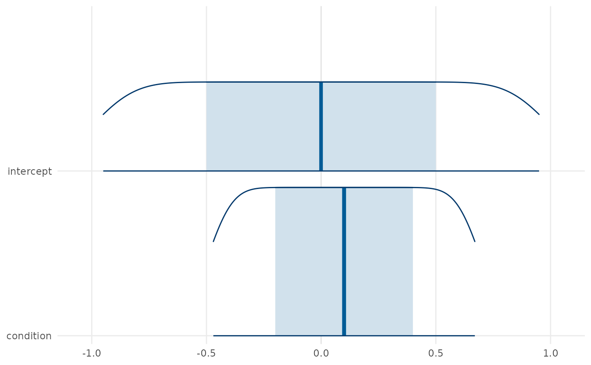

# Posterior Exploration and Publication Graphics

`gp3bayes` separates numerical posterior summaries from graphics. The
same posterior draw matrix can therefore be inspected, tabulated, and
plotted without changing the fitted model or its contract.

## Backend-independent posterior tables

``` r

library(gp3bayes)

draws <- cbind(
  intercept = seq(-1, 1, length.out = 500),
  condition = seq(-0.5, 0.7, length.out = 500)
)

posterior_interval_table(draws)
#>    variable          mean        sd lower        median upper
#> 1 intercept -8.104628e-17 0.5790855 -0.95 -1.110223e-16  0.95
#> 2 condition  1.000000e-01 0.3474513 -0.47  1.000000e-01  0.67
posterior_probability_table(draws, rope = c(-0.1, 0.1))
#>            variable probability_gt_zero probability_lt_zero probability_in_rope
#> intercept intercept               0.500               0.500               0.100
#> condition condition               0.584               0.416               0.166
#>           rope_lower rope_upper
#> intercept       -0.1        0.1
#> condition       -0.1        0.1
posterior_correlation_table(draws)
#>   variable_1 variable_2 correlation  method
#> 1  condition  intercept           1 pearson
```

## Publication graphics

``` r

plot_posterior_intervals(draws)
```



``` r

plot_posterior_areas(draws)
```



The plotting functions return ordinary plotting objects. They do not
alter posterior draws, set decision thresholds, or turn interval
exclusion into an automatic substantive conclusion.

## Fitted-model extraction

For an approved fitted model, the post-fit API standardises extraction
through the `posterior` package:

``` r

draw_array <- extract_posterior_draws(fit, regex = "^b_", format = "array")
draw_df <- extract_posterior_draws(fit, regex = "^b_", format = "df")

mcmc_diagnostic_table(fit)
sampler_diagnostic_table(fit)
quality <- summarise_mcmc_quality(fit)

plot_rank_diagnostics(fit)
plot_autocorrelation(fit)
plot_mcmc_quality(quality)
plot_sampler_diagnostics(fit)
```

Diagnostic flags request inspection. Their absence is not encoded as
proof of model adequacy.
