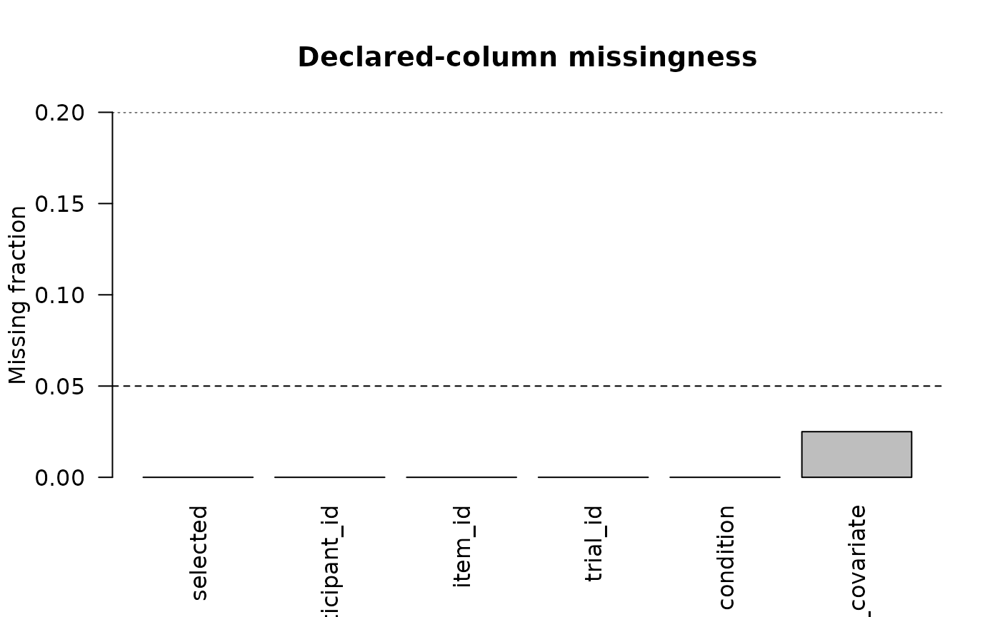
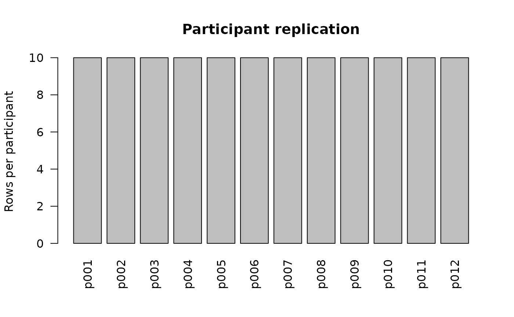
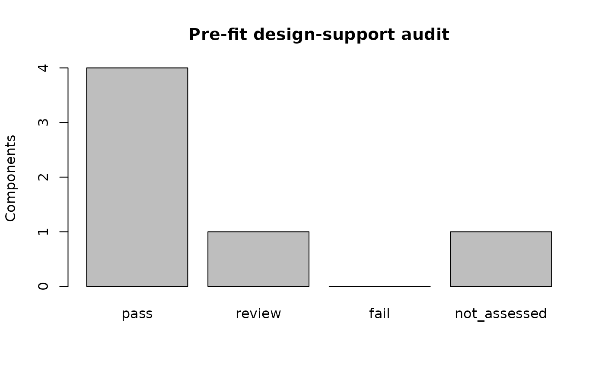

# Pre-fit Design-Support Diagnostics

## Diagnose the design before invoking Stan

Many modeling failures can be identified from the declared design
itself. Version 0.2.0 adds four reporting audits that run before MCMC:

- [`audit_missingness_structure()`](https://stefanosbalaskas.github.io/gp3bayes/reference/audit_missingness_structure.md);
- [`audit_fixed_effect_design()`](https://stefanosbalaskas.github.io/gp3bayes/reference/audit_fixed_effect_design.md);
- [`audit_random_effects_support()`](https://stefanosbalaskas.github.io/gp3bayes/reference/audit_random_effects_support.md);
  and
- [`audit_design_support()`](https://stefanosbalaskas.github.io/gp3bayes/reference/audit_design_support.md).

They do not impute, exclude, drop predictors, or simplify random
effects.

``` r

simulation <- simulate_hierarchical_binary_data(
  n_participants = 12,
  trials_per_participant = 10,
  n_items = 6,
  random_slope_sd = 0,
  seed = 11
)

contract <- create_model_contract(
  family = "binary",
  outcome_col = "selected",
  participant_col = "participant_id",
  item_col = "item_id",
  trial_col = "trial_id",
  condition_col = "condition",
  predictors = "trial_covariate"
)
```

## Missingness is described, not repaired

``` r

with_missing <- simulation$data
with_missing$trial_covariate[c(3, 17, 41)] <- NA_real_

missingness <- audit_missingness_structure(
  with_missing,
  contract
)
missingness
#> <gp3bayes_missingness_audit>
#>   Status: pass
#>   Rows: 120
#>   Missing cells: 3
plot(missingness)
```



## Fixed-effect geometry

The fixed-effects audit reports design-matrix rank, singular values, a
condition-number screen, invariant columns, and leverage. These
quantities are warning signals about the declared numerical design; they
do not determine a scientifically preferred model.

``` r

fixed_design <- audit_fixed_effect_design(
  simulation$data,
  contract
)
fixed_design
#> <gp3bayes_fixed_effect_design_audit>
#>   Status: review
#>   Rank: 3/3
#>   Condition number: 2.6181
#>   High-leverage rows: 3
plot(fixed_design)
```


## Repetition, crossing and random slopes

``` r

random_support <- audit_random_effects_support(
  simulation$data,
  contract
)
random_support
#> <gp3bayes_random_effects_support_audit>
#>   Status: pass
#>               component status
#>  participant_repetition   pass
#>           item_crossing   pass
#>    random_slope_support   pass
plot(random_support)
```



## One combined preflight

``` r

design <- audit_design_support(
  simulation$data,
  contract,
  separation = FALSE,
  strict_readiness = TRUE
)
design
#> <gp3bayes_design_support_audit>
#>   Status: review
#>               component       status
#>      standard_readiness         pass
#>        strict_readiness         pass
#>             missingness         pass
#>     fixed_effect_design       review
#>  random_effects_support         pass
#>              separation not_assessed
#>   Automatic model changes: FALSE
plot(design)
```



For binary models, a fixed-effects separation screen can also be
requested when `detectseparation` is installed:

``` r

audit_design_support(
  simulation$data,
  contract,
  separation = TRUE
)
```

A `review` or `fail` flag is a prompt for methodological inspection. It
is not an automatic instruction to remove data or alter the prespecified
model.
