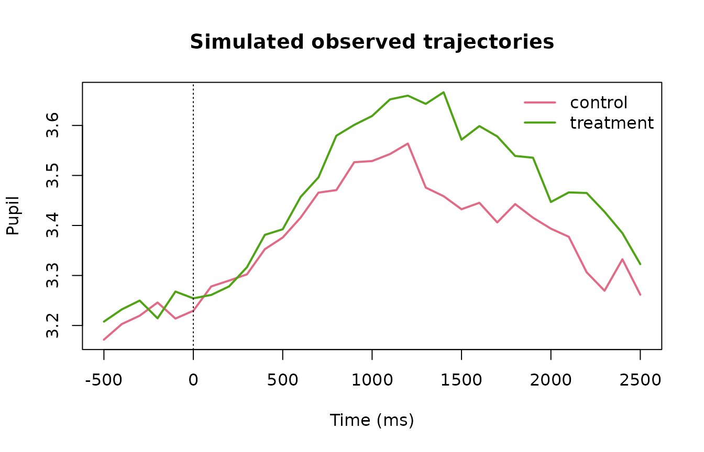

# Robust and Distributional Pupil Models

``` r

library(gp3bayes)
```

## Why separate location and residual scale?

A Gaussian pupil model with constant residual standard deviation assumes
the unexplained variability is similar across the full time course and
conditions. gp3bayes 0.5 can instead declare the residual scale as
constant, condition-dependent, time-dependent, or condition-by-time
dependent. The Student-t option provides a robust observation
distribution without automatically labelling individual observations as
invalid outliers.

``` r

sim <- simulate_advanced_pupil_timecourse(
  n_participants = 10,
  trials_per_participant = 4,
  time_points = 31,
  heteroskedastic_strength = 0.8,
  outlier_fraction = 0.03,
  seed = 3001
)
plot_advanced_pupil_simulation(sim)
```



``` r

gaussian_constant <- specify_pupil_distribution("gaussian", "constant")
gaussian_time <- specify_pupil_distribution("gaussian", "condition_time")
student_time <- specify_pupil_distribution("student", "condition_time")

pupil_distribution_table(gaussian_constant)
#>     family residual_scale robust distributional
#> 1 gaussian       constant  FALSE          FALSE
pupil_distribution_table(gaussian_time)
#>     family residual_scale robust distributional
#> 1 gaussian condition_time  FALSE           TRUE
pupil_distribution_table(student_time)
#>    family residual_scale robust distributional
#> 1 student condition_time   TRUE           TRUE
```

## Candidate specifications are explicit

``` r

spec_constant <- specify_advanced_pupil_timecourse_model(
  sim$data,
  family = "gaussian",
  residual_scale = "constant",
  autocorrelation = "none"
)

spec_distributional <- specify_advanced_pupil_timecourse_model(
  sim$data,
  family = "gaussian",
  residual_scale = "condition_time",
  autocorrelation = "none"
)

spec_robust <- specify_advanced_pupil_timecourse_model(
  sim$data,
  family = "student",
  residual_scale = "condition_time",
  autocorrelation = "none"
)
```

Student-t robustness and residual ARMA are deliberately not combined in
the governed 0.5 interface. They should be treated as distinct modelling
hypotheses and compared against the declared predictive target.

## Posterior residual-scale trajectory

``` r

fit_distributional <- fit_advanced_pupil_model_backend(
  spec_distributional,
  backend = "cmdstanr",
  cores = 2
)

sigma <- estimate_pupil_residual_scale(fit_distributional)
pupil_residual_scale_table(sigma)
plot_pupil_residual_scale(sigma)
```
