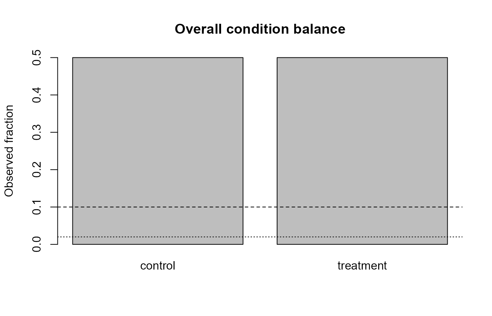
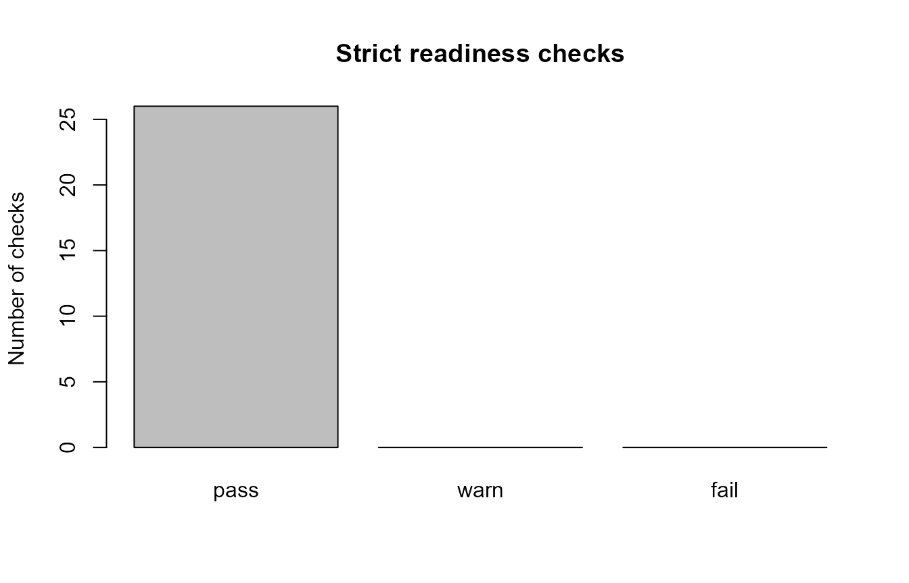

# Specification Closure: Strict Readiness and Governed Validation

## Purpose

This article closes the remaining Phase-0 validation requirements
without expanding gp3bayes beyond its two approved families. The new
checks are observable-data diagnostics. They do not establish posterior
adequacy, choose a model automatically, or justify deleting
observations.

## Binary strict readiness

``` r

bin_sim <- simulate_hierarchical_binary_data(
  n_participants = 20,
  trials_per_participant = 10,
  n_items = 10,
  seed = 2026
)

bin_contract <- create_model_contract(
  family = "binary",
  outcome_col = "selected",
  participant_col = "participant_id",
  item_col = "item_id",
  trial_col = "trial_id",
  condition_col = "condition",
  predictors = c("participant_covariate", "trial_covariate"),
  interaction = c("condition", "participant_covariate"),
  random_slope = FALSE
)

balance <- summarise_condition_balance(bin_sim$data, bin_contract)
balance
#> 
#> Condition-balance audit
#>  Status: pass
#>      level   n fraction
#>    control 100      0.5
#>  treatment 100      0.5
#> Condition balance is an observable design diagnostic. It does not by itself establish identifiability or adequacy.

variation <- summarise_binary_group_variation(
  bin_sim$data,
  bin_contract,
  group = "participant"
)
variation
#> 
#> Binary group-variation audit
#>  Group: participant
#>  Status: pass
#>  Groups without outcome variation: 0

strict_binary <- audit_model_readiness_strict(
  bin_sim$data,
  bin_contract,
  run_separation = FALSE
)
strict_binary
#> 
#> Strict gp3bayes readiness audit
#>  Family: binary
#>  Status: ready
#>  Ready: TRUE
#>  Checks: 26 passed, 0 warnings, 0 failures
```

The strict audit adds explicit overall condition imbalance, participant
outcome variation, identifier-like predictor review, and fixed-effect
rank checks. When `detectseparation` is installed, the optional
separation screen can also be integrated by setting
`run_separation = TRUE`.

``` r

plot(balance)
```



``` r

plot(strict_binary, type = "status")
```



## Identifier-like predictors are review signals

``` r

id_data <- bin_sim$data
id_data$row_id <- seq_len(nrow(id_data))

id_contract <- create_model_contract(
  family = "binary",
  outcome_col = "selected",
  participant_col = "participant_id",
  item_col = "item_id",
  trial_col = "trial_id",
  condition_col = "condition",
  predictors = c("participant_covariate", "row_id")
)

identify_identifier_like_predictors(id_data, id_contract)
#> 
#> Identifier-like predictor audit
#>  Status: review
#>  Flagged predictors: row_id
```

The heuristic never silently removes a declared predictor. A flag means
that the analyst must verify whether the numeric column is substantively
meaningful or is an identifier accidentally entered into the model
matrix.

## Duration extremes, impossible ranges, and censoring

``` r

dur_sim <- simulate_hierarchical_duration_data(
  n_participants = 20,
  trials_per_participant = 10,
  n_items = 10,
  outcome_unit = "milliseconds",
  seed = 2027
)

dur_contract <- create_model_contract(
  family = "duration",
  outcome_col = "duration",
  participant_col = "participant_id",
  item_col = "item_id",
  trial_col = "trial_id",
  condition_col = "condition",
  predictors = c("participant_covariate", "trial_covariate"),
  interaction = c("condition", "participant_covariate"),
  outcome_unit = "milliseconds"
)

extremes <- review_duration_extremes(dur_sim$data, dur_contract)
extremes
#> 
#> Duration extreme-value review
#>  Status: pass
#>  Flagged rows: 0 of 200
#>  Automatic deletion: FALSE

bounds <- audit_duration_boundaries(
  dur_sim$data,
  dur_contract,
  allowed_range = c(50, 10000)
)
bounds
#> 
#> Duration boundary audit
#>  Status: pass
#>                 check_id            category status
#>  declared_duration_range duration_boundaries   pass
#>      uncensored_contract duration_boundaries   pass
#>                                        message n_affected
#>  All durations fall inside the declared range.          0
#>  No censoring-like column names were detected.          0
#>  Automatic family switching: FALSE

strict_duration <- audit_model_readiness_strict(
  dur_sim$data,
  dur_contract,
  duration_allowed_range = c(50, 10000),
  run_separation = FALSE
)
strict_duration
#> 
#> Strict gp3bayes readiness audit
#>  Family: duration
#>  Status: ready
#>  Ready: TRUE
#>  Checks: 29 passed, 0 warnings, 0 failures
```

Extreme values remain in the data. Censoring and impossible-range
violations are contract failures for the positive uncensored lognormal
workflow; they do not trigger an automatic switch to another likelihood.

## Traceability

``` r

gp3bayes_specification_traceability()
#>                                                   requirement
#> 1                          severe overall condition imbalance
#> 2                        participant binary outcome variation
#> 3                          identifier-like numeric predictors
#> 4                               duration extreme-value review
#> 5                    explicit censoring-indicator recognition
#> 6                                     declared duration range
#> 7                fixed-effects separation in strict readiness
#> 8                         random-slope structural sensitivity
#> 9                       participant/item deletion sensitivity
#> 10                  contrast-coding sensitivity specification
#> 11                predictor-scaling sensitivity specification
#> 12                                  duration-unit sensitivity
#> 13            design-standardised binary probability contrast
#> 14        duration median ratio and upper predictive quantile
#> 15                          transformation replay on new data
#> 16          binary detailed PPC calibration/group/cell checks
#> 17 duration detailed PPC tail/group/within-participant checks
#> 18                 exact K-fold predictive validation adapter
#>                                                                                     implementation
#> 1                                    summarise_condition_balance(); audit_model_readiness_strict()
#> 2                               summarise_binary_group_variation(); audit_model_readiness_strict()
#> 3                            identify_identifier_like_predictors(); audit_model_readiness_strict()
#> 4                                       review_duration_extremes(); audit_model_readiness_strict()
#> 5                                      audit_duration_boundaries(); audit_model_readiness_strict()
#> 6                                      audit_duration_boundaries(); audit_model_readiness_strict()
#> 7                                       audit_model_readiness_strict(); detect_binary_separation()
#> 8                           create_random_slope_sensitivity_plan(); run_random_slope_sensitivity()
#> 9                       create_group_deletion_sensitivity_plan(); run_group_deletion_sensitivity()
#> 10                 create_contrast_coding_sensitivity_specification(); audit_estimand_invariance()
#> 11               create_predictor_scaling_sensitivity_specification(); audit_estimand_invariance()
#> 12              create_duration_unit_sensitivity_specification(); audit_duration_unit_invariance()
#> 13                                                    estimate_standardized_probability_contrast()
#> 14                                                      estimate_standardized_duration_estimands()
#> 15 create_transformation_recipe(); apply_transformation_recipe(); validate_transformation_replay()
#> 16                                                                      check_binary_ppc_details()
#> 17                                                                    check_duration_ppc_details()
#> 18                                                                              compute_kfold_cv()
#>         status automatic_decision
#> 1  implemented              FALSE
#> 2  implemented              FALSE
#> 3  implemented              FALSE
#> 4  implemented              FALSE
#> 5  implemented              FALSE
#> 6  implemented              FALSE
#> 7  implemented              FALSE
#> 8  implemented              FALSE
#> 9  implemented              FALSE
#> 10 implemented              FALSE
#> 11 implemented              FALSE
#> 12 implemented              FALSE
#> 13 implemented              FALSE
#> 14 implemented              FALSE
#> 15 implemented              FALSE
#> 16 implemented              FALSE
#> 17 implemented              FALSE
#> 18 implemented              FALSE
```

The table is intended to make specification closure auditable: every
remaining Phase-0 requirement has an explicit implementation point and
all automatic decision flags remain `FALSE`.
