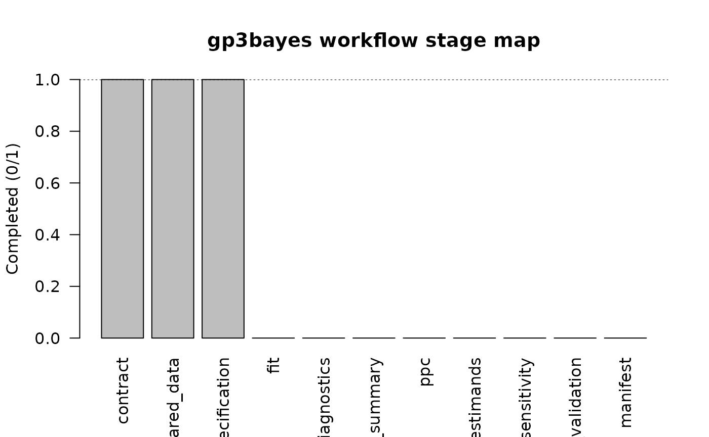

# A Stable Unified Workflow API

## Why a unified API?

The family-specific `gp3bayes` functions remain the authoritative
low-level interfaces. Version 0.2.0 adds a small family-neutral layer so
an analysis pipeline can use the same verbs after a binary or duration
model has been fitted. The wrappers dispatch only inside the two
approved model families. They do not accept arbitrary formulas,
likelihoods, Stan programs, or fitting algorithms.

The stable verbs are:

- [`diagnose_model_fit()`](https://stefanosbalaskas.github.io/gp3bayes/reference/diagnose_model_fit.md)
  for numerical sampling diagnostics;
- [`summarise_model_posterior()`](https://stefanosbalaskas.github.io/gp3bayes/reference/summarise_model_posterior.md)
  for family-specific posterior summaries;
- [`check_model_ppc()`](https://stefanosbalaskas.github.io/gp3bayes/reference/check_model_ppc.md)
  for family-specific posterior predictive checks;
- [`estimate_model_estimands()`](https://stefanosbalaskas.github.io/gp3bayes/reference/estimate_model_estimands.md)
  for the approved standardized estimands;
- [`validate_gp3bayes_object()`](https://stefanosbalaskas.github.io/gp3bayes/reference/validate_gp3bayes_object.md)
  for structural object checks; and
- [`model_workflow_status()`](https://stefanosbalaskas.github.io/gp3bayes/reference/model_workflow_status.md)
  for a descriptive stage map.

## Build a backend-independent specification

``` r

simulation <- simulate_hierarchical_binary_data(
  n_participants = 12,
  trials_per_participant = 8,
  n_items = 6,
  random_slope_sd = 0,
  seed = 2026
)

contract <- create_model_contract(
  family = "binary",
  outcome_col = "selected",
  participant_col = "participant_id",
  item_col = "item_id",
  trial_col = "trial_id",
  condition_col = "condition"
)

prepared <- prepare_hierarchical_binary_data(
  simulation$data,
  contract,
  condition_levels = c("control", "treatment")
)

specification <- specify_binary_model(
  prepared,
  baseline = 0.35
)
```

Structural validation is deliberately different from statistical
validation:

``` r

validate_gp3bayes_object(contract)
#> <gp3bayes_object_validation>
#>   Status: pass
#>   Class: gp3bayes_model_contract
#>   Family: binary
#>   Checks: 3 pass, 0 review, 0 fail
validate_gp3bayes_object(specification)
#> <gp3bayes_object_validation>
#>   Status: pass
#>   Class: gp3bayes_binary_model_specification, gp3bayes_model_specification
#>   Family: binary
#>   Checks: 5 pass, 0 review, 0 fail
```

## Inspect workflow progress

``` r

workflow <- model_workflow_status(specification)
workflow
#> <gp3bayes_workflow_status>
#>                  stage completed
#>               contract      TRUE
#>          prepared_data      TRUE
#>          specification      TRUE
#>                    fit     FALSE
#>            diagnostics     FALSE
#>      posterior_summary     FALSE
#>                    ppc     FALSE
#>              estimands     FALSE
#>            sensitivity     FALSE
#>  predictive_validation     FALSE
#>               manifest     FALSE
plot(workflow)
```



The stage map says what objects are present. It does **not** say the
analysis is adequate, robust, causal, or complete.

## Fit through either approved backend

Full MCMC is optional and intentionally not executed while this vignette
is built.

``` r

fit <- fit_binary_model_backend(
  specification,
  backend = "cmdstanr", # or "rstan"
  chains = 2,
  iter = 2000,
  warmup = 1000,
  cores = 2,
  seed = 2026
)
```

After fitting, the same verbs work for either approved family:

``` r

diagnostics <- diagnose_model_fit(fit)
posterior <- summarise_model_posterior(fit)
ppc <- check_model_ppc(fit, draws = 400, seed = 2026)
estimands <- estimate_model_estimands(fit)

plot_sampling_diagnostics(fit, type = "trace")
```

## What the unified layer does not do

A stable API is not a license to automate scientific judgment. In
particular, these wrappers do not automatically select a model, delete
observations, change a random-effects structure, declare posterior
adequacy, or translate an association into a causal effect. Those
boundaries remain explicit throughout 0.2.0.
