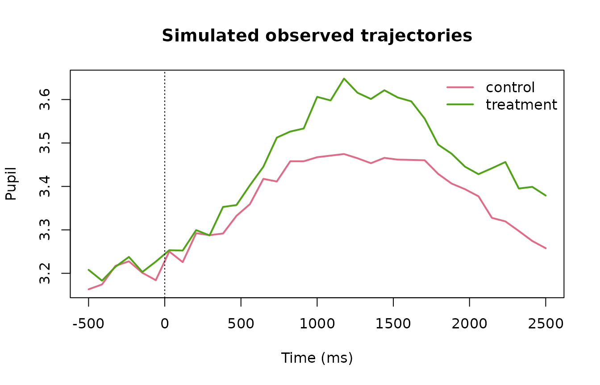
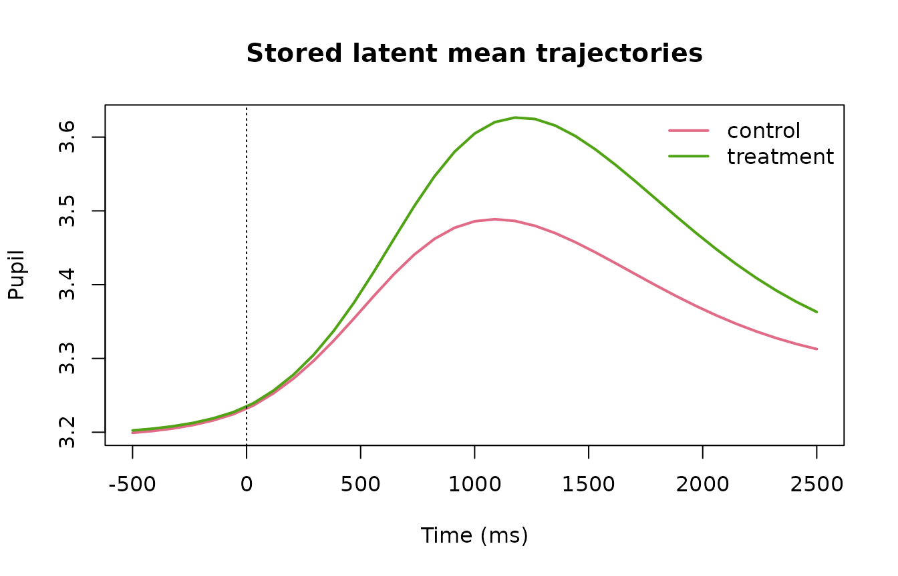
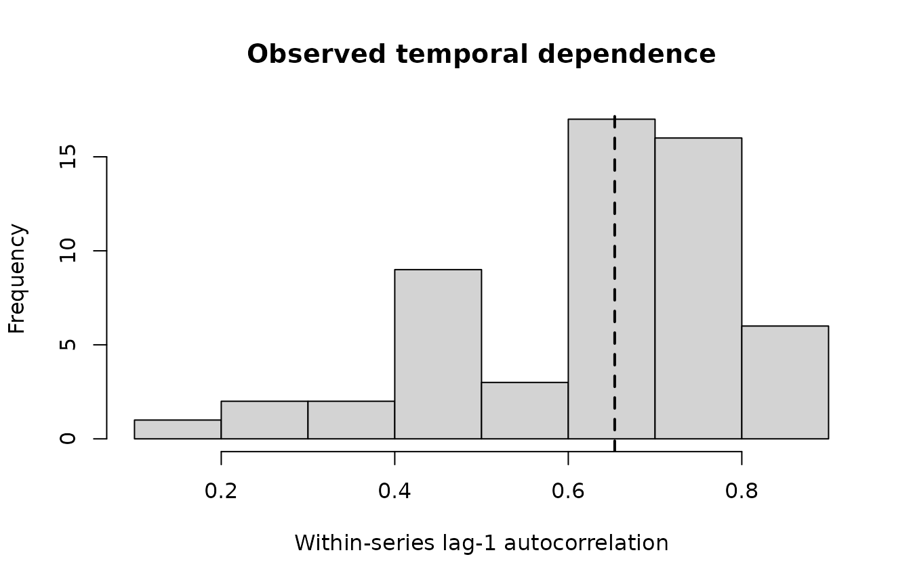
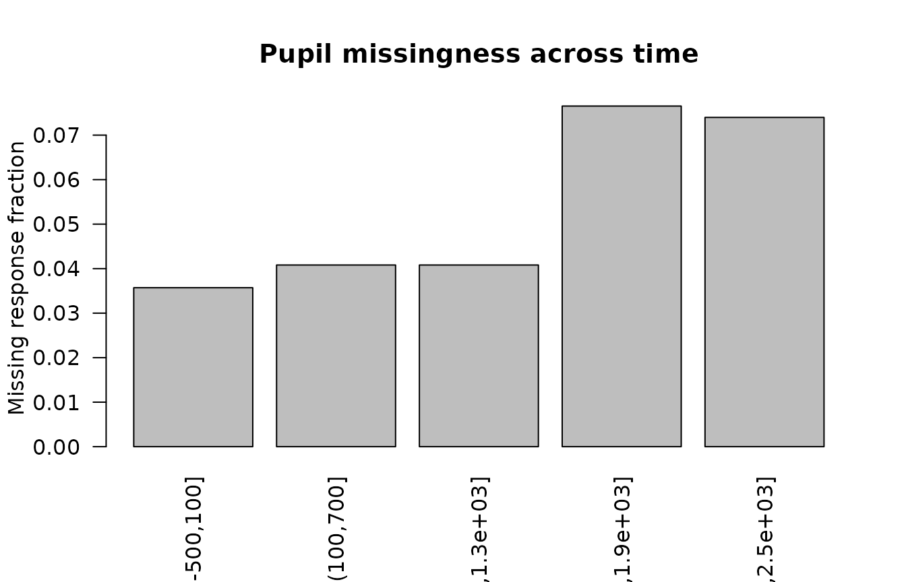
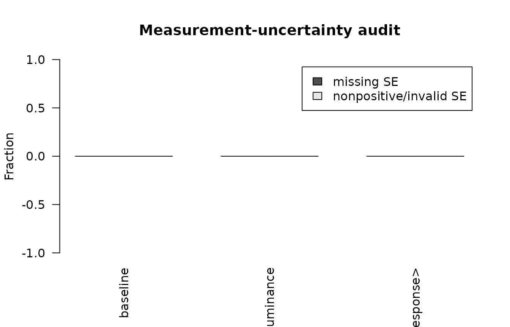

# Synthetic Advanced Pupillometry Gallery

``` r

library(gp3bayes)
sim <- simulate_advanced_pupil_timecourse(
  n_participants = 14,
  trials_per_participant = 4,
  time_points = 35,
  heteroskedastic_strength = 0.7,
  ar = 0.5,
  outlier_fraction = 0.02,
  missing_fraction = 0.06,
  seed = 3080
)
```

## Observed trajectories

``` r

plot_advanced_pupil_simulation(sim, observed = TRUE)
```



## Stored latent mean

``` r

plot_advanced_pupil_simulation(sim, observed = FALSE)
```



## Temporal dependence

``` r

temporal <- audit_pupil_temporal_dependence(sim$data)
plot_pupil_temporal_dependence(temporal)
```



## Missingness

``` r

missing <- create_pupil_missingness_spec(response = "model")
measurement <- create_pupil_measurement_model(
  baseline_error = "baseline_se",
  luminance_error = "luminance_se",
  response_error = "pupil_se"
)

spec <- specify_advanced_pupil_timecourse_model(
  sim$data,
  covariates = c("baseline_pupil", "luminance"),
  measurement_model = measurement,
  missingness_model = missing,
  autocorrelation = "none"
)

missing_audit <- audit_pupil_missingness(spec)
plot_pupil_missingness(missing_audit)
```



``` r


measurement_audit <- audit_pupil_measurement_model(spec)
plot_pupil_measurement_uncertainty(measurement_audit)
```



## Computational audit

``` r

plot_pupil_model_complexity(spec)
```


## Binocular example

``` r

bi <- simulate_binocular_pupil_timecourse(
  n_participants = 10,
  trials_per_participant = 4,
  time_points = 31,
  seed = 3081
)
prep <- prepare_binocular_pupil_timecourse(bi$data)
audit_binocular_pupil_readiness(prep)
#> <gp3bayes_binocular_pupil_audit>
#>   Status: pass 
#>                    metric        value
#>                      rows 1.240000e+03
#>   left_available_fraction 9.741935e-01
#>  right_available_fraction 9.725806e-01
#>   both_available_fraction 9.661290e-01
#>     mean_right_minus_left 1.433966e-02
#>       sd_right_minus_left 3.038599e-02
#>       pearson_correlation 9.910785e-01
```

The gallery is intentionally backend-free so it can be built during
package checks without compiling Stan. Full posterior plot examples are
shown in the modelling vignettes with fitting code disabled by default.
